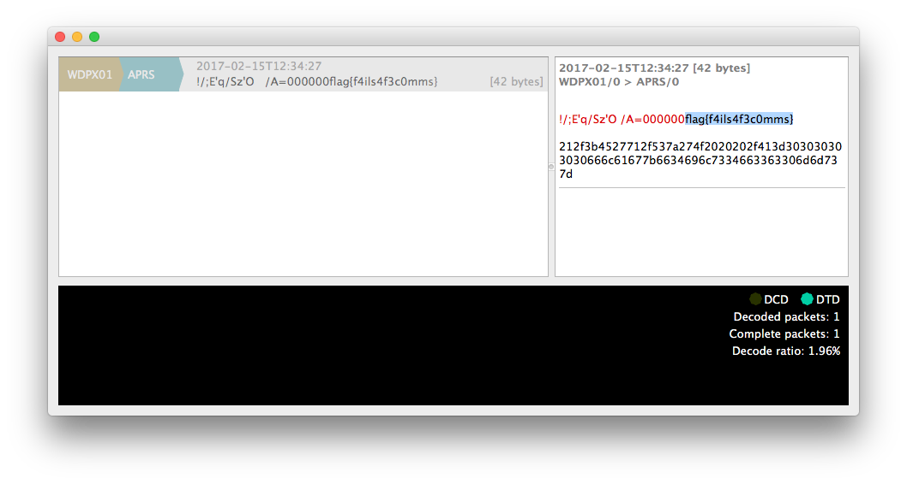

# BSidesSF CTF 2017 - Latlong (Forensics 150)

>Transmission Received.

>This challenge was created by our pal @arirubinstein.
>He was not informed of the flag format, so expect this one to be look something like flag{...}

>[transmission](https://scoreboard.ctf.bsidessf.com/attachment/ebfe5bf449bd7723179c69816019e1ff71ada65d3a76d178599da3ac928c4206)

The file seems to be an audio file and at first I thought it was a 56Kbps "Dial-up modem noise" (who used to connect to the Internet some years ago, will definitely remember).

But luckily, shortly after the admins posted an hint:

>Hint - "Ax25 will lead you in the direction"

AX.25 (Amateur X.25) is a data link layer protocol suite and designed for use by amateur radio operators.

So it was clear that we had to decode the file using the protocol [specification](https://www.tapr.org/pub_ax25.html).

I started reading the protocol specification, and I was going to implement a decoder, but I was sure I could find something already implemented.

I found this decoder on GitHub: [Invasive](https://github.com/h2so5/Invasive)

And opening the file audio with this decoder showed the flag:

